# 🛬 Runway Segmentation Model

A **high-precision semantic segmentation model** for **runway detection** in aerial imagery, trained on **1920×1080 resolution** images.

---

## 📘 Overview

This repository contains a trained **ResNet34-UNet** model that accurately segments runways in aerial imagery.  
The model was trained on **3,987 high-resolution images** and achieves:

- **IoU (Intersection over Union):** 92.43%  
- **Dice Score:** 95.35%

The goal of this project is to provide a reliable, high-resolution segmentation model for detecting and delineating runways in aerial or satellite datasets.

---

## 🧠 Model Details

| Attribute | Description |
|------------|-------------|
| **Architecture** | ResNet34-UNet |
| **Parameters** | 47.8 Million |
| **Input Resolution** | 1920×1080 |
| **Loss Function** | Weighted Cross-Entropy + Dice Loss |
| **Class Weights** | Background = 0.5442, Foreground = 6.1558 |
| **Batch Size** | 4 |
| **Learning Rate** | 0.0002 |
| **Epochs** | 100 (early stopping at 88) |
| **Augmentations** | Geometric and color transformations |
| **Precision** | Mixed Precision (FP16) |

---

## 📊 Dataset

| Detail | Description |
|--------|--------------|
| **Total Images** | 3,987 |
| **Images with Runways** | 3,918 |
| **Images without Runways** | 69 |
| **Validation Split** | Stratified (3,388 train / 599 validation) |
| **Image Size** | 1920×1080 (Full Resolution) |

## 🚀 Training Summary

| Metric | Value |
|--------|--------|
| **Best Validation IoU** | **0.9243** |
| **Best Validation Dice** | **0.9535** |
| **Early Stopping Epoch** | 88 |
| **Early Stopping Patience** | 15 epochs |

The model converged stably with consistent performance across both metrics, ensuring robustness on unseen data.

---

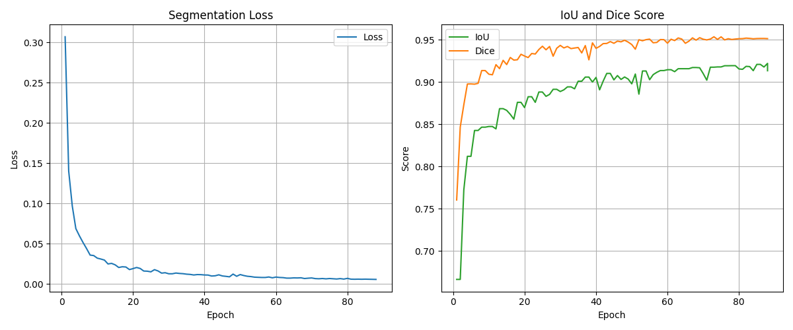
*Figure 1: IOU/Dice score progression during training.*

## 🧪 Qualitative Results

| **Test Image** | **Model Segmentation Output** |
|-----------------|-------------------------------|
| 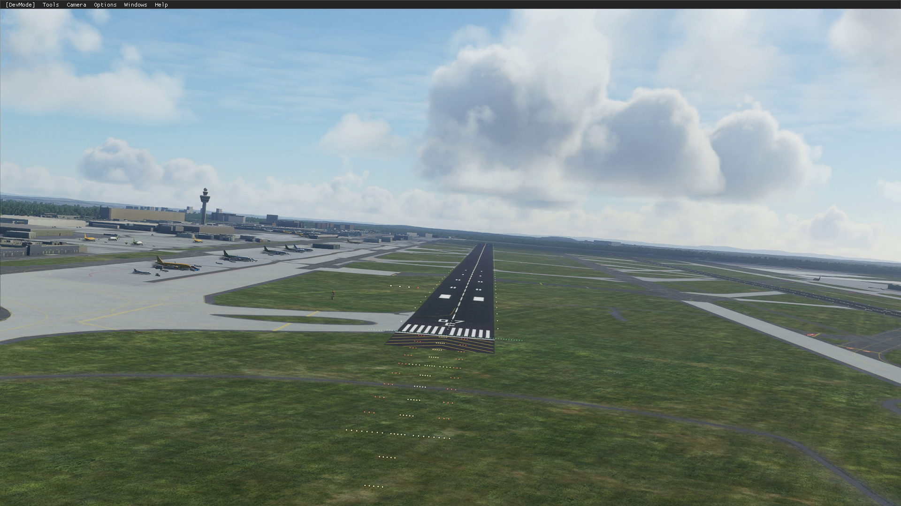 | 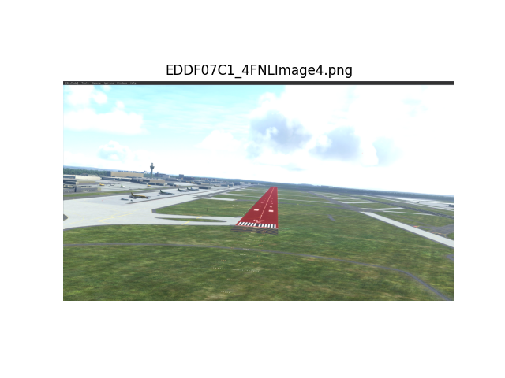 |
| 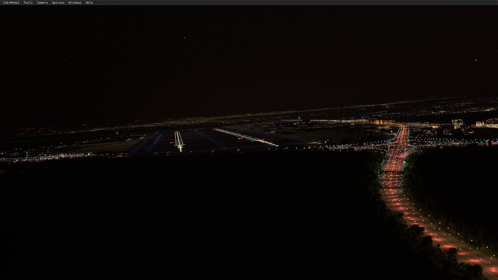 | 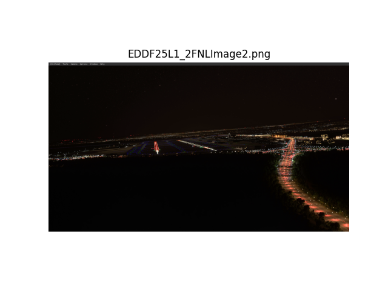 |
| 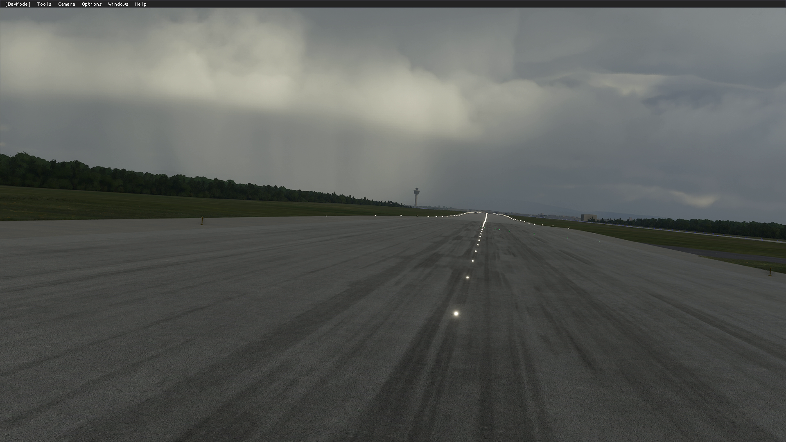 | 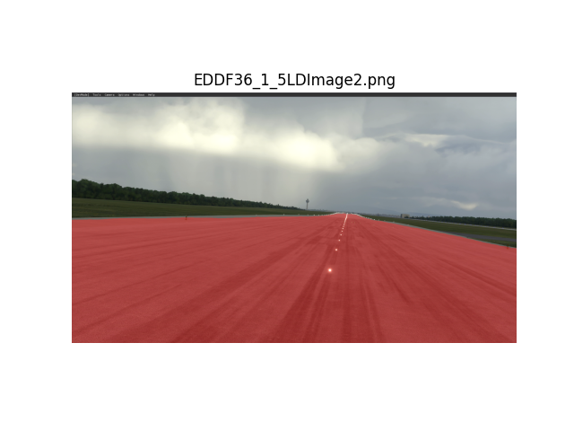 |
| 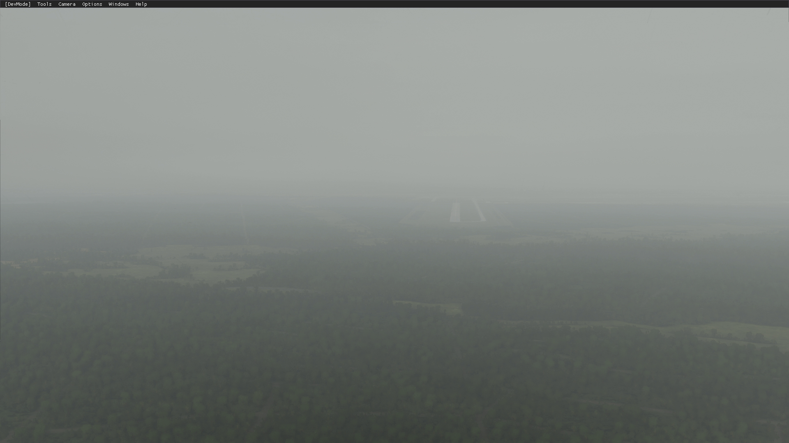 | 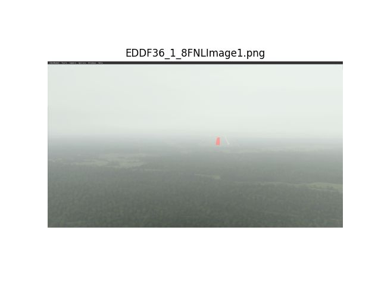 |
| 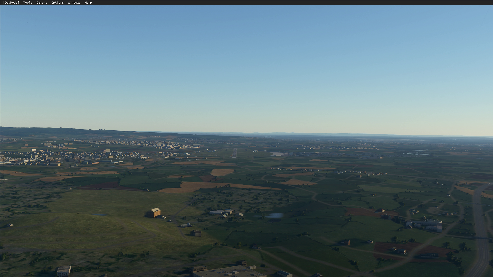 | 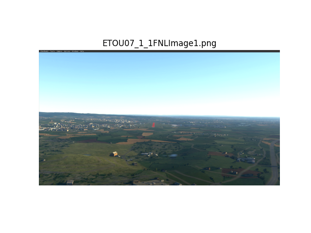 |

*Figure 2: Visual comparison of runway segmentation results on test images.*

